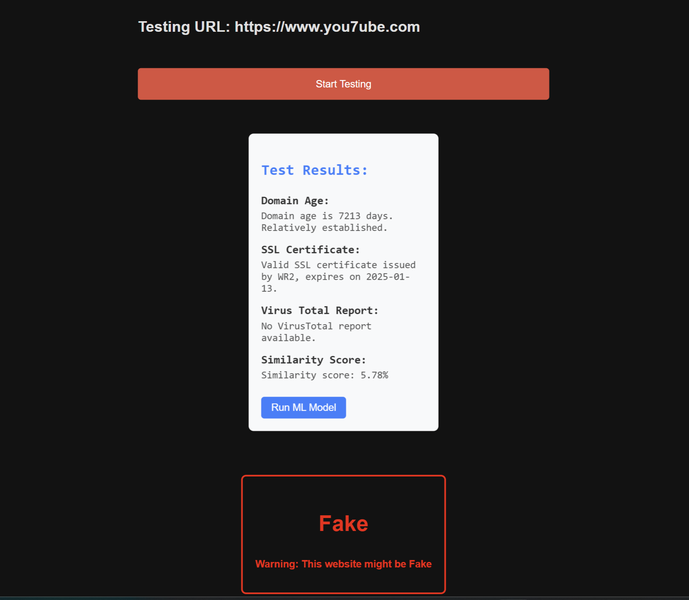

<h1 align="center"> ⚠️ Fake Website Detection 💻❗</h1>
<h3 align="left">
🔴Welcome to the Fake Website Detection System, where you can perform two primary operations:

<h3 align = "left"> 1.URL Scanning: </h3>

This feature identifies and analyzes potential fake websites similar to a given base URL.
When you provide a URL, the system generates variations (e.g., typosquatting, homoglyphs, or altered domain extensions) and checks which of these variations are live on the internet.
Each generated URL undergoes the same detailed analysis as in the URL Validation operation, including: 
🔴Domain Age Verification: Checking how old the domain is to determine its legitimacy. 
🔴SSL Certificate Validation: Verifying the presence and validity of SSL certificates. 
🔴VirusTotal API Scan: Detecting potential malware or threats. 
🔴Machine Learning Prediction: Using a Random Forest Classifier to predict whether the URL is fake. 
🔴Web Scraping for Similarity: Comparing the content of the generated URL with the base URL to measure similarity. 
This feature is especially useful for detecting phishing sites and fake websites impersonating legitimate ones, helping users safeguard their online activity.

<h3 align = "left"> 2.URL Validation: </h3>

Input a base URL to generate potential fake websites (e.g., typosquatting variations) that are live on the internet. 
Each generated URL can then be analyzed using: 
🔴Domain age, SSL Certificate verfication and VirusTotal. 
🔴ML-based prediction. 
🔴Web scraping for similarity comparison. 
These features ensure comprehensive URL analysis and detection for safe browsing and security evaluation. 

<h3 align="left">Languages and Tools Used:</h3>

            

### After Clicking Scan URL:

### After Clicking URL Validation:

